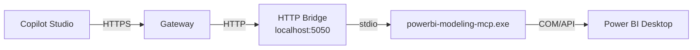
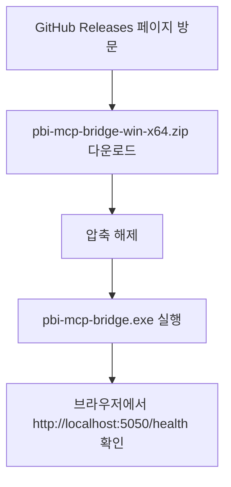
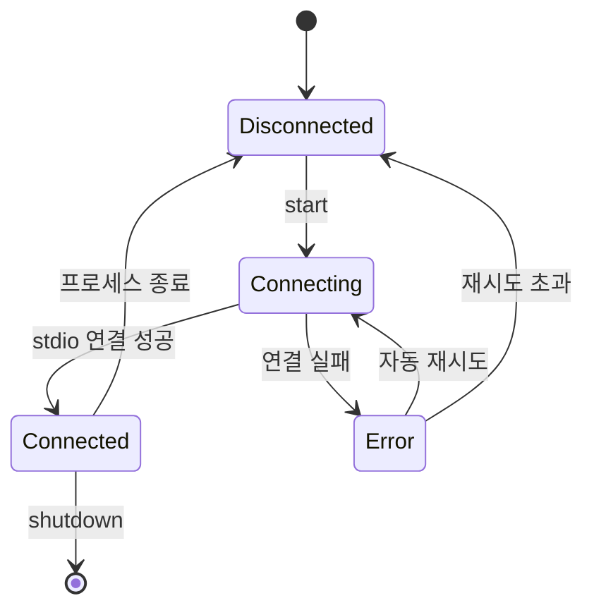
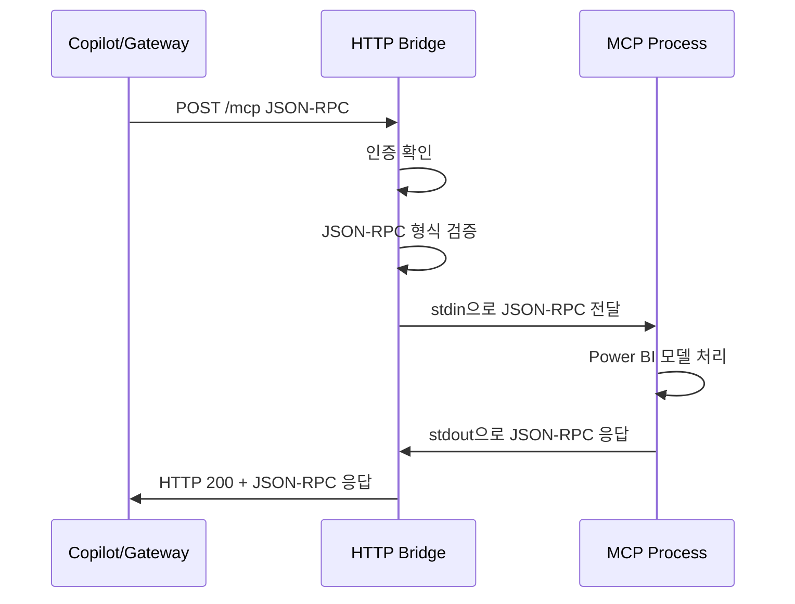
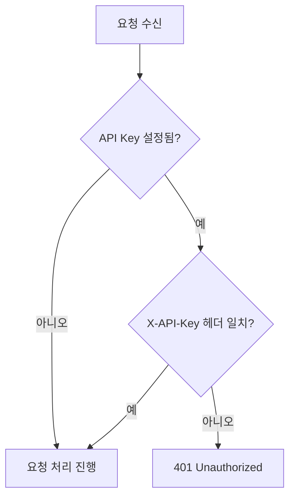

# Copilot + Power BI Desktop MCP Bridge — 아키텍처 설계 문서

## 1. 개요

### 1.1 목적
Copilot Studio가 로컬 PC의 Power BI Desktop 모델에 접근할 수 있도록 HTTP Bridge를 제공합니다.

### 1.2 전체 흐름



### 1.3 핵심 설계 원칙
- **비개발자 우선**: 설치 과정이 최대 3단계를 넘지 않아야 함
- **단일 실행파일**: Node.js 설치 없이 .exe 하나로 실행 가능
- **제로 설정 기본값**: 설정 파일 없이도 기본값으로 즉시 실행 가능
- **보안 기본값**: localhost 바인딩, 선택적 API Key

---

## 2. 기술 스택

| 구분 | 선택 | 이유 |
|------|------|------|
| **런타임** | Node.js 20 LTS | stdio 핸들링 네이티브 지원, HTTP 서버 구축 용이, MCP SDK 호환 |
| **HTTP 프레임워크** | Express.js | 경량, 미들웨어 생태계, 비개발자도 이해 가능한 구조 |
| **MCP 통신** | @modelcontextprotocol/sdk | 공식 MCP SDK로 stdio 트랜스포트 안정적 지원 |
| **설정 관리** | dotenv + yaml | .env로 간단 설정, config.yaml로 상세 설정 지원 |
| **로깅** | winston | 파일/콘솔 동시 로깅, 레벨 제어 |
| **패키징** | pkg (by @nicobailon/pkg) 또는 nexe | Node.js 런타임 포함 단일 .exe 생성 |
| **언어** | TypeScript | 타입 안전성, 유지보수성, MCP SDK가 TS 기반 |

### 2.1 기술 스택 선택 이유

**Node.js를 선택한 이유:**
- `child_process.spawn`으로 stdio 기반 MCP 서버와의 통신이 가장 자연스러움
- MCP 공식 SDK가 TypeScript/Node.js 기반
- 유사 프로젝트(mcp-bridge, supergateway, mcp-proxy)가 모두 Node.js 기반
- pkg를 통해 Node.js 런타임을 포함한 단일 .exe 배포 가능

**Express.js를 선택한 이유:**
- 최소한의 코드로 HTTP 서버 구축 가능
- JSON body parsing, CORS, 에러 핸들링 미들웨어 기본 제공
- 커뮤니티가 크고 문제 해결 레퍼런스가 풍부

---

## 3. 설치 방식

### 3.1 주 설치 방식: 미리 빌드된 단일 .exe (GitHub Releases)

비개발자에게 가장 친화적인 방식으로 **GitHub Releases에서 .exe 다운로드** 방식을 채택합니다.



**배포 패키지 구성:**
```
pbi-mcp-bridge-win-x64.zip
├── pbi-mcp-bridge.exe          # Node.js 런타임 포함 단일 실행파일
├── config.yaml.example         # 설정 예시 파일
├── README.txt                  # 빠른 시작 가이드 (한국어/영어)
└── install-service.bat         # 선택: Windows 서비스 등록 스크립트
```

### 3.2 보조 설치 방식: 개발자용 npm

```bash
git clone https://github.com/{owner}/copilot-powerbi-desktop-mcp-bridge.git
cd copilot-powerbi-desktop-mcp-bridge
npm install
npm run build
npm start
```

### 3.3 설치 방식 비교

| 방식 | 대상 | 장점 | 단점 |
|------|------|------|------|
| **GitHub Releases .exe** ⭐ | 비개발자 | Node.js 설치 불필요, 더블클릭 실행 | 파일 크기 약 50-80MB |
| npm install | 개발자 | 소스 수정 가능, 최신 버전 | Node.js 설치 필요 |
| PowerShell 원클릭 | 중간 사용자 | 자동화 가능 | 실행 정책 변경 필요할 수 있음 |

### 3.4 빌드 파이프라인


GitHub Actions를 통해 태그 push 시 자동으로:
1. TypeScript 컴파일
2. pkg로 Windows x64 .exe 빌드
3. zip 패키징
4. GitHub Release 생성 및 업로드

---

## 4. 디렉토리 구조

```
copilot-powerbi-desktop-mcp-bridge/
├── .github/
│   └── workflows/
│       ├── build.yml              # CI: 빌드 + 테스트
│       └── release.yml            # CD: 태그 시 .exe 빌드 + Release
├── src/
│   ├── index.ts                   # 엔트리포인트 — 서버 시작
│   ├── server.ts                  # Express 서버 설정 및 미들웨어
│   ├── routes/
│   │   ├── mcp.ts                 # POST /mcp 라우트
│   │   └── health.ts              # GET /health 라우트
│   ├── mcp/
│   │   ├── client.ts              # MCP stdio 클라이언트 관리
│   │   ├── transport.ts           # stdio 트랜스포트 래퍼
│   │   └── types.ts               # MCP 관련 타입 정의
│   ├── config/
│   │   ├── index.ts               # 설정 로더 (yaml + env + CLI args)
│   │   └── defaults.ts            # 기본 설정값
│   ├── middleware/
│   │   ├── auth.ts                # API Key 인증 미들웨어
│   │   ├── logging.ts             # 요청/응답 로깅 미들웨어
│   │   └── error.ts               # 에러 핸들링 미들웨어
│   └── utils/
│       ├── logger.ts              # winston 로거 설정
│       └── process.ts             # 프로세스 관리 유틸리티
├── tests/
│   ├── unit/
│   │   ├── mcp-client.test.ts     # MCP 클라이언트 단위 테스트
│   │   └── config.test.ts         # 설정 로더 단위 테스트
│   └── integration/
│       └── api.test.ts            # API 통합 테스트
├── scripts/
│   ├── build-exe.js               # pkg 빌드 스크립트
│   └── install-service.bat        # Windows 서비스 등록
├── config.yaml.example            # 설정 예시 파일
├── .env.example                   # 환경변수 예시 파일
├── package.json                   # Node.js 프로젝트 설정
├── tsconfig.json                  # TypeScript 설정
├── .gitignore
├── README.md                      # 프로젝트 소개 및 설치 가이드
├── ARCHITECTURE.md                # 이 문서
└── LICENSE                        # MIT License
```

---

## 5. API 엔드포인트 설계

### 5.1 엔드포인트 목록

| 메서드 | 경로 | 설명 |
|--------|------|------|
| `POST` | `/mcp` | MCP JSON-RPC 메시지 전달 (범용) |
| `GET` | `/health` | Bridge 상태 확인 |

### 5.2 POST /mcp — MCP JSON-RPC 전달

모든 MCP 프로토콜 메시지를 단일 엔드포인트로 처리합니다. MCP 프로토콜이 JSON-RPC 2.0 기반이므로, method 필드로 `tools/list`, `tools/call` 등을 구분합니다.

**요청:**
```http
POST /mcp HTTP/1.1
Content-Type: application/json
X-API-Key: {optional-api-key}

{
  "jsonrpc": "2.0",
  "id": 1,
  "method": "tools/list",
  "params": {}
}
```

**응답 (tools/list 예시):**
```json
{
  "jsonrpc": "2.0",
  "id": 1,
  "result": {
    "tools": [
      {
        "name": "execute_dax",
        "description": "Execute a DAX query against the Power BI model",
        "inputSchema": {
          "type": "object",
          "properties": {
            "query": { "type": "string" }
          },
          "required": ["query"]
        }
      }
    ]
  }
}
```

**요청 (tools/call 예시):**
```json
{
  "jsonrpc": "2.0",
  "id": 2,
  "method": "tools/call",
  "params": {
    "name": "execute_dax",
    "arguments": {
      "query": "EVALUATE ROW(\"Total Sales\", [Total Sales])"
    }
  }
}
```

**에러 응답:**
```json
{
  "jsonrpc": "2.0",
  "id": 2,
  "error": {
    "code": -32603,
    "message": "MCP server not connected"
  }
}
```

### 5.3 GET /health — 상태 확인

**응답:**
```json
{
  "status": "ok",
  "bridge": {
    "version": "1.0.0",
    "uptime": 3600
  },
  "mcp": {
    "connected": true,
    "exe": "powerbi-modeling-mcp.exe",
    "pid": 12345
  }
}
```

### 5.4 HTTP 상태 코드

| 코드 | 상황 |
|------|------|
| 200 | 정상 응답 (MCP 에러도 200으로 반환, JSON-RPC error 필드로 구분) |
| 400 | 잘못된 JSON-RPC 형식 |
| 401 | API Key 인증 실패 |
| 500 | Bridge 내부 오류 |
| 503 | MCP 서버 미연결 |

---

## 6. 핵심 컴포넌트 설계

### 6.1 MCP Client 생명주기



**핵심 동작:**
- Bridge 시작 시 `powerbi-modeling-mcp.exe`를 `child_process.spawn`으로 실행
- stdin/stdout을 통해 JSON-RPC 메시지 교환
- MCP 프로세스 비정상 종료 시 자동 재시작 (최대 3회, 지수 백오프)
- Bridge 종료 시 MCP 프로세스 graceful shutdown

### 6.2 요청 처리 흐름



### 6.3 요청-응답 매칭

stdio 기반 통신에서 요청과 응답을 매칭하기 위해:
- JSON-RPC의 `id` 필드를 사용하여 요청/응답 매칭
- `Map<string|number, PendingRequest>` 구조로 대기 중인 요청 관리
- 타임아웃 설정 (기본 30초)으로 응답 없는 요청 처리

---

## 7. 설정 시스템

### 7.1 설정 우선순위

높은 우선순위가 낮은 우선순위를 덮어씁니다:

```
CLI 인수 > 환경변수 > .env 파일 > config.yaml > 기본값
```

### 7.2 config.yaml 구조

```yaml
# Bridge 서버 설정
server:
  port: 5050              # HTTP 서버 포트
  host: "127.0.0.1"       # 바인딩 주소 (기본: localhost만)

# MCP 서버 설정
mcp:
  command: "powerbi-modeling-mcp.exe"  # MCP 실행파일 경로
  args: []                             # 추가 인수
  cwd: null                            # 작업 디렉토리 (null = Bridge와 동일)
  env: {}                              # 추가 환경변수
  restart:
    enabled: true          # 비정상 종료 시 자동 재시작
    maxRetries: 3          # 최대 재시도 횟수
    backoffMs: 1000        # 초기 대기 시간 (지수 증가)

# 보안 설정
security:
  apiKey: null             # null = 인증 비활성화, 문자열 = API Key 필수

# 로깅 설정  
logging:
  level: "info"            # error, warn, info, debug
  file: "bridge.log"       # 로그 파일 경로 (null = 파일 로깅 비활성화)
  console: true            # 콘솔 출력 여부

# 요청 처리 설정
request:
  timeoutMs: 30000         # MCP 응답 대기 타임아웃
```

### 7.3 .env 예시

```env
# 간단 설정 — config.yaml 대신 사용 가능
PORT=5050
HOST=127.0.0.1
MCP_COMMAND=powerbi-modeling-mcp.exe
API_KEY=
LOG_LEVEL=info
```

### 7.4 기본값 전략

설정 파일이 전혀 없어도 실행 가능하도록 모든 항목에 합리적인 기본값을 제공합니다:
- **포트**: 5050 (다른 서비스와 충돌 가능성 낮음)
- **호스트**: 127.0.0.1 (보안 기본값)
- **MCP 경로**: 같은 디렉토리의 `powerbi-modeling-mcp.exe`
- **인증**: 비활성화 (localhost 전용이므로)
- **로그 레벨**: info

---

## 8. 보안 설계

### 8.1 네트워크 보안

| 항목 | 기본값 | 설명 |
|------|--------|------|
| **바인딩 주소** | 127.0.0.1 | 외부 네트워크 접근 차단 |
| **CORS** | 비활성화 | 브라우저 기반 접근 불필요 |
| **HTTPS** | 미지원 | Gateway가 HTTPS 처리, Bridge는 localhost HTTP |

### 8.2 API Key 인증 (선택적)



- `config.yaml`의 `security.apiKey` 또는 환경변수 `API_KEY`로 설정
- 값이 비어있으면 인증 비활성화 (기본값)
- `X-API-Key` 헤더로 전달

### 8.3 요청 로깅

모든 요청에 대해 다음을 로깅합니다:
- 타임스탬프
- HTTP 메서드 + 경로
- MCP method 이름
- 응답 시간
- 에러 여부

민감한 데이터 (DAX 쿼리 결과 등)는 `debug` 레벨에서만 기록합니다.

### 8.4 프로세스 보안

- MCP 프로세스는 Bridge와 동일한 사용자 권한으로 실행
- stdio 통신으로 네트워크 노출 없음
- Bridge 종료 시 MCP 프로세스도 확실하게 종료

---

## 9. 프로젝트 파일 목록

생성해야 할 모든 파일의 전체 목록입니다:

### 9.1 소스 코드

| 파일 | 설명 |
|------|------|
| `src/index.ts` | 엔트리포인트 — 설정 로드, 서버 시작, 시그널 핸들링 |
| `src/server.ts` | Express 앱 생성, 미들웨어 등록, 라우트 연결 |
| `src/routes/mcp.ts` | POST /mcp 라우트 — JSON-RPC 검증 및 MCP 전달 |
| `src/routes/health.ts` | GET /health 라우트 — 상태 정보 반환 |
| `src/mcp/client.ts` | MCP 프로세스 관리 — spawn, 재시작, 요청/응답 매칭 |
| `src/mcp/transport.ts` | stdio 트랜스포트 — 스트림 읽기/쓰기, 버퍼 처리 |
| `src/mcp/types.ts` | MCP 관련 TypeScript 인터페이스/타입 |
| `src/config/index.ts` | 설정 로더 — yaml/env/cli 병합 |
| `src/config/defaults.ts` | 기본 설정값 상수 |
| `src/middleware/auth.ts` | API Key 인증 미들웨어 |
| `src/middleware/logging.ts` | 요청/응답 로깅 미들웨어 |
| `src/middleware/error.ts` | 전역 에러 핸들러 |
| `src/utils/logger.ts` | winston 로거 설정 |
| `src/utils/process.ts` | 프로세스 유틸리티 (graceful shutdown 등) |

### 9.2 테스트

| 파일 | 설명 |
|------|------|
| `tests/unit/mcp-client.test.ts` | MCP 클라이언트 단위 테스트 |
| `tests/unit/config.test.ts` | 설정 로더 단위 테스트 |
| `tests/integration/api.test.ts` | API 엔드포인트 통합 테스트 |

### 9.3 빌드 및 CI/CD

| 파일 | 설명 |
|------|------|
| `.github/workflows/build.yml` | CI — 빌드 + 테스트 |
| `.github/workflows/release.yml` | CD — 태그 시 .exe 빌드 + Release 생성 |
| `scripts/build-exe.js` | pkg 빌드 스크립트 |
| `scripts/install-service.bat` | Windows 서비스 등록 배치 파일 |

### 9.4 설정 및 프로젝트 파일

| 파일 | 설명 |
|------|------|
| `package.json` | Node.js 프로젝트 설정, 의존성, 스크립트 |
| `tsconfig.json` | TypeScript 컴파일 설정 |
| `config.yaml.example` | 설정 파일 예시 |
| `.env.example` | 환경변수 예시 |
| `.gitignore` | Git 무시 패턴 |

### 9.5 문서

| 파일 | 설명 |
|------|------|
| `README.md` | 프로젝트 소개, 빠른 시작, 설치 가이드 |
| `ARCHITECTURE.md` | 아키텍처 설계 문서 (이 문서) |
| `LICENSE` | MIT 라이선스 |
| `README.txt` | 빌드 배포 패키지 내 빠른 시작 (한국어/영어) |

---

## 10. 의존성 패키지

### 10.1 런타임 의존성

```json
{
  "dependencies": {
    "express": "^4.18.0",
    "@modelcontextprotocol/sdk": "^1.0.0",
    "js-yaml": "^4.1.0",
    "dotenv": "^16.3.0",
    "winston": "^3.11.0",
    "uuid": "^9.0.0"
  }
}
```

### 10.2 개발 의존성

```json
{
  "devDependencies": {
    "typescript": "^5.3.0",
    "@types/node": "^20.0.0",
    "@types/express": "^4.17.0",
    "@types/js-yaml": "^4.0.0",
    "@types/uuid": "^9.0.0",
    "pkg": "^5.8.0",
    "jest": "^29.7.0",
    "ts-jest": "^29.1.0",
    "@types/jest": "^29.5.0",
    "ts-node": "^10.9.0"
  }
}
```

---

## 11. package.json 스크립트

```json
{
  "scripts": {
    "build": "tsc",
    "start": "node dist/index.js",
    "dev": "ts-node src/index.ts",
    "test": "jest",
    "test:watch": "jest --watch",
    "build:exe": "node scripts/build-exe.js",
    "lint": "tsc --noEmit"
  }
}
```

---

## 12. 향후 확장 고려사항

현재 버전에서는 구현하지 않지만, 아키텍처에서 고려하는 사항:

1. **SSE/Streamable HTTP 지원**: 현재는 단순 요청-응답이지만, MCP 알림(notification)을 위해 SSE 엔드포인트 추가 가능
2. **다중 MCP 서버**: 여러 MCP 서버를 동시에 관리하는 프록시 모드
3. **GUI 대시보드**: 상태 모니터링을 위한 간단한 웹 UI
4. **자동 업데이트**: exe 버전의 자동 업데이트 메커니즘
5. **Windows 트레이 앱**: 시스템 트레이에서 실행/중지/설정 관리
