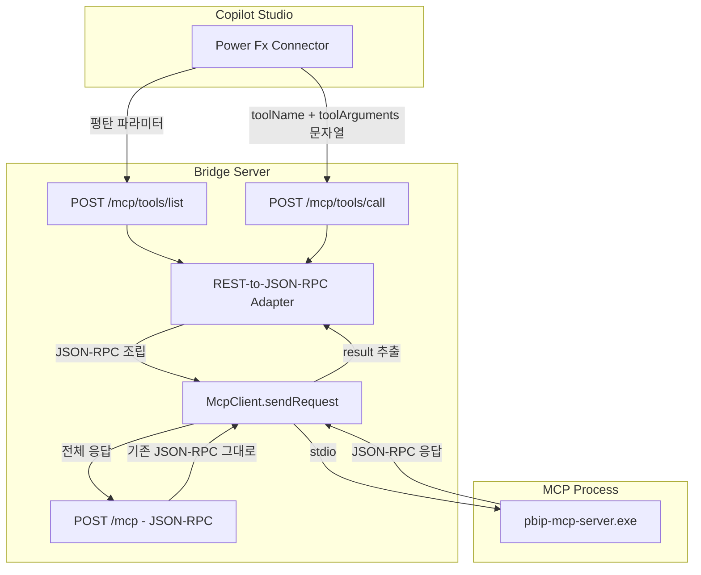

# Copilot Studio 호환성을 위한 API 평탄화 설계

## 1. 문제 분석

### 현재 상황
- `POST /mcp` 엔드포인트가 JSON-RPC 2.0 형식을 받음
- Copilot Studio의 Power Fx 커넥터는 **중첩된 JSON 객체를 파라미터로 전달할 수 없음**

### 실패하는 요청 예시 (tools/call)
```json
{
  "jsonrpc": "2.0",
  "id": "req-1",
  "method": "tools/call",
  "params": {           // ← 중첩 객체: Copilot Studio에서 전달 불가
    "name": "table_operations",
    "arguments": {      // ← 이중 중첩: 더더욱 불가
      "action": "List"
    }
  }
}
```

### 성공하는 요청 예시 (tools/list)
```json
{
  "jsonrpc": "2.0",
  "id": "req-1",
  "method": "tools/list",
  "params": {}          // ← 빈 객체여서 Copilot Studio가 생략 가능
}
```

### 근본 원인
Copilot Studio Power Fx 커넥터의 제약사항:
- 요청 body에 **원시 타입(string, number, boolean)만** 전달 가능
- 중첩 객체(`params.name`, `params.arguments`)를 구성할 수 없음
- Swagger 정의에서 `type: "object"`인 필드에 값을 동적으로 채울 수 없음

## 2. 옵션 비교

| 기준 | 옵션 A: 기존 엔드포인트 확장 | 옵션 B: 개별 REST 엔드포인트 | 옵션 C: 쿼리 파라미터 방식 |
|------|---------------------------|---------------------------|-------------------------|
| 설명 | `/mcp`에 `toolName`, `toolArguments` 평탄 필드 추가 | `/mcp/tools/list`, `/mcp/tools/call` 별도 엔드포인트 | `/mcp?method=tools/call&toolName=...` |
| Copilot Studio 호환 | ✅ 가능 | ✅ 가능 | ⚠️ body+query 혼합 시 문제 가능 |
| 기존 호환성 | ⚠️ JSON-RPC 필드와 평탄 필드 혼재 | ✅ 기존 `/mcp` 그대로 유지 | ❌ 기존 방식과 충돌 |
| Swagger 명확성 | ⚠️ 하나의 스키마에 두 방식 혼재 | ✅ 각 엔드포인트별 명확한 스키마 | ⚠️ 복잡 |
| 구현 복잡도 | 낮음 | 중간 | 중간 |
| 유지보수성 | ⚠️ 조건 분기 로직 복잡 | ✅ 각 핸들러가 단일 책임 | ⚠️ 파싱 로직 복잡 |

## 3. 선택: 옵션 B - 개별 REST 엔드포인트

### 선택 이유
1. **기존 호환성 100% 유지**: 기존 `POST /mcp` 엔드포인트를 전혀 수정하지 않음
2. **명확한 Swagger 정의**: 각 엔드포인트가 자체적인 평탄 스키마를 가짐
3. **단일 책임 원칙**: 각 핸들러가 하나의 MCP 메서드만 처리
4. **Copilot Studio 친화적**: 모든 파라미터가 원시 타입(string)으로 전달 가능

## 4. 상세 설계

### 4.1 새 엔드포인트 정의

#### `POST /mcp/tools/list` - 도구 목록 조회

**요청 Body** (파라미터 없음 또는 빈 body):
```json
{}
```

**내부 변환**: 서버가 JSON-RPC 요청으로 조립
```json
{
  "jsonrpc": "2.0",
  "id": "<auto-generated-uuid>",
  "method": "tools/list",
  "params": {}
}
```

**응답** (JSON-RPC 래핑 없이 result만 반환):
```json
{
  "tools": [
    {
      "name": "table_operations",
      "description": "...",
      "inputSchema": { ... }
    }
  ]
}
```

---

#### `POST /mcp/tools/call` - 도구 실행

**요청 Body** (평탄한 필드):
```json
{
  "toolName": "table_operations",
  "toolArguments": "{\"action\": \"List\"}"
}
```

| 필드 | 타입 | 필수 | 설명 |
|------|------|------|------|
| `toolName` | string | ✅ | 실행할 도구 이름 |
| `toolArguments` | string | ✅ | 도구 인자 (JSON 문자열) |

> **핵심**: `toolArguments`는 JSON 문자열로 전달됨. Copilot Studio에서 문자열은 전달 가능하므로, 중첩 객체 문제를 해결함.

**내부 변환**: 서버가 JSON-RPC 요청으로 조립
```json
{
  "jsonrpc": "2.0",
  "id": "<auto-generated-uuid>",
  "method": "tools/call",
  "params": {
    "name": "table_operations",
    "arguments": { "action": "List" }
  }
}
```

**응답** (JSON-RPC 래핑 없이 result만 반환):
```json
{
  "content": [
    {
      "type": "text",
      "text": "..."
    }
  ]
}
```

**에러 응답**:
```json
{
  "error": {
    "code": -32602,
    "message": "toolName is required"
  }
}
```

### 4.2 아키텍처 흐름



### 4.3 파일 변경 계획

#### 신규 파일

| 파일 | 설명 |
|------|------|
| `src/routes/mcp-rest.ts` | 평탄화된 REST 엔드포인트 라우터 |

#### 수정 파일

| 파일 | 변경 내용 |
|------|-----------|
| [`src/server.ts`](src/server.ts) | 새 라우터 등록: `app.use("/mcp/tools", ...)` |
| [`connector/apiDefinition.swagger.json`](connector/apiDefinition.swagger.json) | 새 엔드포인트 2개 Swagger 정의 추가 |

#### 변경 없는 파일

| 파일 | 이유 |
|------|------|
| [`src/routes/mcp.ts`](src/routes/mcp.ts) | 기존 JSON-RPC 엔드포인트 그대로 유지 |
| [`src/mcp-client.ts`](src/mcp-client.ts) | sendRequest 인터페이스 변경 없음 |
| [`src/types.ts`](src/types.ts) | 기존 타입 변경 없음 (새 타입은 mcp-rest.ts에 정의) |

### 4.4 `src/routes/mcp-rest.ts` 설계

```typescript
// 새 라우터: REST 평탄 엔드포인트
import { Router, Request, Response } from "express";
import { McpClient } from "../mcp-client";
import { JsonRpcRequest, McpProcessState } from "../types";
import { randomUUID } from "crypto";

// 평탄화된 요청 타입
interface ToolCallRequest {
  toolName: string;
  toolArguments: string; // JSON 문자열
}

export function createMcpRestRouter(mcpClient: McpClient): Router {
  const router = Router();

  // POST /mcp/tools/list
  router.post("/list", async (req: Request, res: Response) => {
    // 1. MCP 프로세스 상태 확인
    // 2. JSON-RPC 요청 조립: { jsonrpc: "2.0", id: uuid, method: "tools/list", params: {} }
    // 3. mcpClient.sendRequest() 호출
    // 4. 응답에서 result만 추출하여 반환 (또는 error 처리)
  });

  // POST /mcp/tools/call
  router.post("/call", async (req: Request, res: Response) => {
    // 1. toolName, toolArguments 검증
    // 2. toolArguments JSON 파싱 (실패 시 400 에러)
    // 3. MCP 프로세스 상태 확인
    // 4. JSON-RPC 요청 조립:
    //    { jsonrpc: "2.0", id: uuid, method: "tools/call",
    //      params: { name: toolName, arguments: parsedArgs } }
    // 5. mcpClient.sendRequest() 호출
    // 6. 응답에서 result만 추출하여 반환 (또는 error 처리)
  });

  return router;
}
```

### 4.5 `src/server.ts` 변경

```typescript
// 기존 코드에 추가
import { createMcpRestRouter } from "./routes/mcp-rest";

// 라우트 등록 부분에 추가
app.use("/mcp", createMcpRouter(mcpClient));           // 기존 유지
app.use("/mcp/tools", createMcpRestRouter(mcpClient));  // 새로 추가
app.use("/health", createHealthRouter(mcpClient));
```

> **라우트 순서 참고**: Express는 구체적인 경로(`/mcp/tools/list`)를 먼저 매칭하므로, `/mcp/tools`를 `/mcp` 뒤에 등록해도 정상 동작함. `/mcp/tools/list`로 들어온 요청은 `/mcp/tools` 라우터가 처리하고, `/mcp`로 들어온 요청은 기존 라우터가 처리함.

### 4.6 Swagger 정의 변경

기존 `/mcp`와 `/health` 경로는 유지하고, 아래 2개 경로를 추가:

```json
{
  "/mcp/tools/list": {
    "post": {
      "operationId": "ListTools",
      "summary": "사용 가능한 MCP 도구 목록 조회",
      "description": "MCP 서버에서 사용 가능한 도구 목록을 조회합니다",
      "parameters": [
        {
          "name": "X-API-Key",
          "in": "header",
          "required": false,
          "type": "string",
          "description": "API Key",
          "x-ms-summary": "API Key"
        }
      ],
      "responses": {
        "200": {
          "description": "도구 목록",
          "schema": {
            "type": "object",
            "properties": {
              "tools": {
                "type": "array",
                "description": "사용 가능한 도구 목록",
                "items": {
                  "type": "object",
                  "properties": {
                    "name": {
                      "type": "string",
                      "description": "도구 이름"
                    },
                    "description": {
                      "type": "string",
                      "description": "도구 설명"
                    }
                  }
                }
              }
            }
          }
        }
      }
    }
  },
  "/mcp/tools/call": {
    "post": {
      "operationId": "CallTool",
      "summary": "MCP 도구 실행",
      "description": "지정한 MCP 도구를 실행하고 결과를 반환합니다",
      "parameters": [
        {
          "name": "body",
          "in": "body",
          "required": true,
          "schema": {
            "type": "object",
            "required": ["toolName", "toolArguments"],
            "properties": {
              "toolName": {
                "type": "string",
                "description": "실행할 도구 이름",
                "x-ms-summary": "도구 이름"
              },
              "toolArguments": {
                "type": "string",
                "description": "도구 인자 - JSON 문자열",
                "x-ms-summary": "도구 인자 JSON"
              }
            }
          }
        },
        {
          "name": "X-API-Key",
          "in": "header",
          "required": false,
          "type": "string",
          "description": "API Key",
          "x-ms-summary": "API Key"
        }
      ],
      "responses": {
        "200": {
          "description": "도구 실행 결과",
          "schema": {
            "type": "object",
            "properties": {
              "content": {
                "type": "array",
                "description": "실행 결과 컨텐츠",
                "items": {
                  "type": "object",
                  "properties": {
                    "type": {
                      "type": "string",
                      "description": "컨텐츠 타입"
                    },
                    "text": {
                      "type": "string",
                      "description": "텍스트 결과"
                    }
                  }
                }
              }
            }
          }
        },
        "400": {
          "description": "잘못된 요청 - toolName 누락 또는 toolArguments JSON 파싱 실패"
        }
      }
    }
  }
}
```

## 5. Copilot Studio Power Fx 사용 예시

### 도구 목록 조회
```
PowerBIMCPBridge.ListTools()
```

### 도구 실행
```
PowerBIMCPBridge.CallTool({
    toolName: "table_operations",
    toolArguments: "{""action"": ""List""}"
})
```

### DAX 쿼리 실행 예시
```
PowerBIMCPBridge.CallTool({
    toolName: "execute_dax",
    toolArguments: "{""query"": ""EVALUATE ROW('Sales', SUM(Sales[Amount]))""}"
})
```

## 6. 에러 처리 매핑

| 상황 | HTTP 상태 | 응답 |
|------|-----------|------|
| `toolName` 누락 | 400 | `{ "error": { "code": -32602, "message": "toolName is required" } }` |
| `toolArguments` JSON 파싱 실패 | 400 | `{ "error": { "code": -32602, "message": "toolArguments is not valid JSON" } }` |
| MCP 프로세스 미실행 | 502 | `{ "error": { "code": -32001, "message": "MCP process not running" } }` |
| MCP 요청 타임아웃 | 504 | `{ "error": { "code": -32002, "message": "MCP request timed out" } }` |
| MCP 요청 실패 | 502 | `{ "error": { "code": -32003, "message": "MCP request failed" } }` |
| 서버 내부 오류 | 500 | `{ "error": { "code": -32603, "message": "Internal server error" } }` |

## 7. 구현 체크리스트

- [ ] `src/routes/mcp-rest.ts` 신규 파일 생성
  - [ ] `POST /list` 핸들러 구현
  - [ ] `POST /call` 핸들러 구현 (toolArguments JSON 파싱 포함)
  - [ ] 공통 에러 처리 헬퍼 함수
- [ ] `src/server.ts` 수정: 새 라우터 등록
- [ ] `connector/apiDefinition.swagger.json` 수정: 2개 엔드포인트 추가
- [ ] 기존 `POST /mcp` 엔드포인트 정상 동작 확인 (회귀 테스트)
- [ ] 새 엔드포인트 수동 테스트
  - [ ] `POST /mcp/tools/list` 정상 응답 확인
  - [ ] `POST /mcp/tools/call` 정상 응답 확인
  - [ ] `POST /mcp/tools/call` 에러 케이스 확인 (toolName 누락, 잘못된 JSON)
